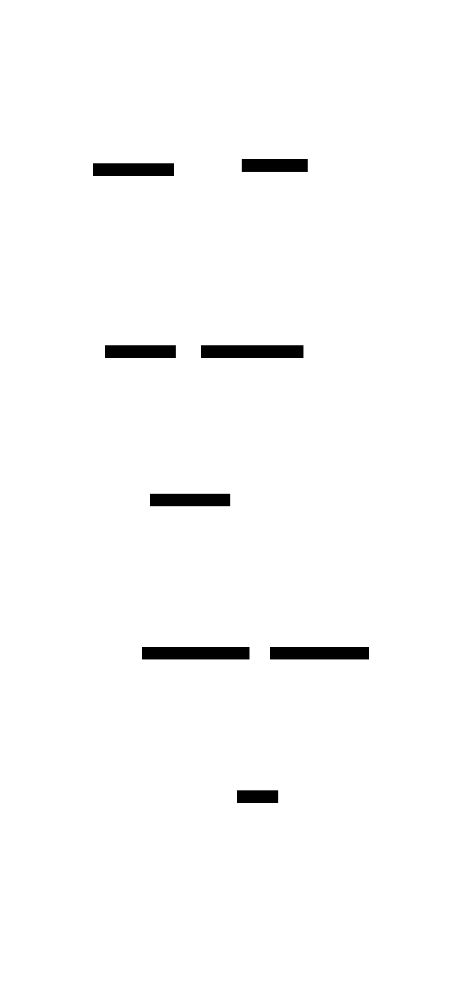

# ioaiaaii.net

So, this is an over-engineered website :).
Wanted to gather my work from here and there and to maintain o project for experiments.
This is a BFF, with Vue.js and Go backend, engineered using Clean Architecture and adhering to SRE principles.

## System Design and API Spec

## ADRs

## Release Engineering
TBD
### Repo Operator
TBD
### Build
TBD
- distroless
- kaniko
- hermetic

### CI

TBD
- GH Workflows caching
- resuable

### Releasing
TBD
### Packaging
TBD
## Observability
TBD

## Profiling and Capacity Planning
TBD
