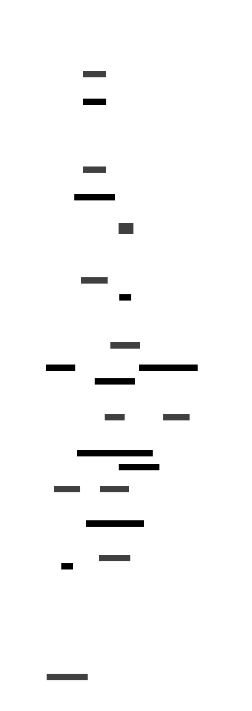

# ioaiaaii.net

So, this is an over-engineered website :).
Wanted to gather my work from here and there and to maintain a project for experiments.
This is a BFF, with Vue.js and Go backend, engineered using Clean Architecture and adhering to SRE principles.

## System Design and API Spec

Specifics about the system engineering with API doc with [OpenAPI Spec](./docs/api/README.md) and [Architecture](./docs/desing/system-architecture.md).



## ADRs

Keeping (at least) the most [important decisions](./docs/adr/) in specific format.

## Release Engineering

### Repo Operator

Port [repo-operator](https://github.com/ioaiaaii/repo-operator) as submodule, and use ready non-local config, and makefiles.
All workflows are using reproducible and hermetic builds, to support all CI/CD operations, from repo-operator. Few makefile targets with `local-*` prefix, are fow specific local dev help.

### CI

### Linting

- Lint with golang-ci, and use GH Workflows caching for quick run
- Lint vue.js TBD

### Testing

- Unit-testing TBD
- Smoke/Functional TBD

### Security

- Scan with Trivy
- Cache Trivy-DB with GH

### Packaging

- Multistage builds
- Use Distrolles
- Layers serialization with diff priority
- Cache where possible
- Lint with Harodlint:

    ```json
    [{"code":"DL3006","column":1,"file":"-","level":"warning","line":1,"message":"Always tag the version of an image explicitly"},{"code":"DL3015","column":1,"file":"-","level":"info","line":2,"message":"Avoid additional packages by specifying `--no-install-recommends`"},{"code":"DL3009","column":1,"file":"-","level":"info","line":2,"message":"Delete the apt-get lists after installing something"},{"code":"SC2154","column":1,"file":"-","level":"warning","line":2,"message":"node_verion is referenced but not assigned (did you mean 'node_version'?)."},{"code":"DL3045","column":1,"file":"-","level":"warning","line":4,"message":"`COPY` to a relative destination without `WORKDIR` set."},{"code":"DL3003","column":1,"file":"-","level":"warning","line":5,"message":"Use WORKDIR to switch to a directory"},{"code":"DL3016","column":1,"file":"-","level":"warning","line":5,"message":"Pin versions in npm. Instead of `npm install <package>` use `npm install <package>@<version>`"},{"code":"DL3011","column":1,"file":"-","level":"error","line":8,"message":"Valid UNIX ports range from 0 to 65535"}]make: *** [image-lint] Error 1
    ```

### Build

- Use kaniko with caching remote repo

    Currently around 1-2m to build and push

- Build efficiency check with dive

    ```shell
    Image Source: docker://europe-west3-docker.pkg.dev/micro-infra/micro-repo/ioaiaaii:v1.1.9
    Fetching image... (this can take a while for large images)
    Analyzing image...
    efficiency: 99.9943 %
    wastedBytes: 1513 bytes (1.5 kB)
    userWastedPercent: 0.0079 %
    Inefficient Files:
    Count  Wasted Space  File Path
        2         900 B  /etc/passwd
        2         613 B  /usr/lib/os-release
        2           0 B  /tmp
        2           0 B  /root
    Results:
    PASS: highestUserWastedPercent
    PASS: highestWastedBytes
    PASS: lowestEfficiency
    Result:PASS [Total:3] [Passed:3] [Failed:0] [Warn:0] [Skipped:0]
    ```

## CD

- In context of delivery, an [ArgoCD ApplicationSet](https://github.com/ioaiaaii/micro-infra/blob/main/gitops/domain/continues-delivery.yaml) with `pullRequest` generator is monitoring for PRs, with the gh label `preview.

- In the context of deployment, an [ArgoCD Application](https://github.com/ioaiaaii/micro-infra/blob/main/gitops/domain/continues-delivery.yaml) listens to new tags and deploys.

## Releasing

- progressive releasing to be evaluated with [kargo](https://kargo.io/)
- using tracing and slos, to evaluate canarying with argo rollouts.
- currently:
    1. check latest upstream tag and select the new vX.X.X
    2. bump helm chart appVersion to new tag vX.X.X
    3. after merge, head to master and cut a tag with `git tag vX.X.X
    4. workflows will deliver the new image, argo will deploy it
    5. workflows will publish a new release, with conventional commit spec:

        <a name="v1.1.7"></a>
        ## [v1.1.7] - 2024-11-15
        ### 🐛 Bug Fixes
        - **website:** image path for dec-pdc

        ### 🛠️ Chores
        - **deploy:** bump chart appversion
        - **iac:** module update with new images

        ### Pull Requests
        - Merge pull request [#41](https://github.com/ioaiaaii/ioaiaaii.net/issues/41) from ioaiaaii/chore/images-improvements
        - Merge pull request [#40](https://github.com/ioaiaaii/ioaiaaii.net/issues/40) from ioaiaaii/chore/images-improvements
        - Merge pull request [#39](https://github.com/ioaiaaii/ioaiaaii.net/issues/39) from ioaiaaii/chore/images-improvements

## Observability

### Logs

Currently, using `slog`, with the toleration, if otel collector is not up, to print structured logs to stdout.
Otherwise, logger provider pushes logs to otel collector.
In terms of logging, better to log only errors or super helpful debug/info paths.

### Metrics

Currently, otelfiber is ready for network related metrics.
Only added go performance metrics for now.
Check exemplars in the future.

### Traces

Otelfabric handles tracing, we just use the tracer provider with context.

## Development

1. Run docker and have `make` bin
2. Get available commands from repo-operator, or wrappers for local dev help:

```shell
make help
```

```yaml
        local-dev             local-dev, runs bff and backend locally in dev mode
        website-lint:         website-build, builds vite project
        website-build:        website-build, builds vite project
        local-preview         local-preview, runs bff and backend in preview mode (production)
        local-docker-lint     local-docker-lint, fetching non-local target and linting all project's images
        local-docker-build    local-docker-build, fetching non-local target and building all project's images
        local-docker-push     local-docker-push, fetching non-local target and building all project's images
        local-docker-run      local-docker-run, fetching non-local target docker-run and run all images in the backround
        help                  autogenerated help target
                              add info to your command inserting before definition:
                                "## <text>"
        environment           Prints the current tag,branch and version
        gitignore             Syncs gitignore configuration
        pre-commit-hooks-list  Syncs pre-commit-hooks configuration
        pre-commit-hooks      Syncs pre-commit-hooks configuration
        generate-docs:        Generate OpenAPI documentation as Markdown
        go-mod-update:        Update dependencies
        go-mod-sync:          Runs go mod {tidy, vendor, verify}
        go-lint:              Runs linter
        go-test:              Runs tests
        go-build:             Builds Linux binary for amd64 architecture (for Kubernetes deployment)
        image-lint            Runs hadolint on Dockerfile
        docker-image:         Builds image. Call it with VERSION arg to parse Image tag. 
                              e.g. `make docker-image VERSION=feat/packaging_dockerfile`
        docker-push           Tags and Pushes image to a Registry. Currently to DockerHub
        docker-run:           Detects the default exposed port from container's image, and run the container with the exposed port
        kaniko-docker-image   Build Docker image with Kaniko and cache repo
                                run it with DOCKER_IMAGE_REPO="<registry url>" DOCKER_IMAGE=<image>
                               it auto detects if running in GH with Identity Pool Service Account
        dive-ci               Inspect image with dive
                                run it with DOCKER_IMAGE_REPO="<registry url>" DOCKER_IMAGE=<image>
        trivy-scan:           Trivy Security Scanner
        chart-testing         Runs ct linting
        otel-ci               Runs otel-collector
        conventional-commit-lint  commit message linting with conventional-commit spec
        conventional-changelog  changelog generator CHANGELOG.md
        conventional-changelog-release  changelog generator for specific tag linked to github release notes
```

3. `local-dev` simply runs both components in different reported ports.
4. have fun :beer


## Profiling and Capacity Planning

TBD

